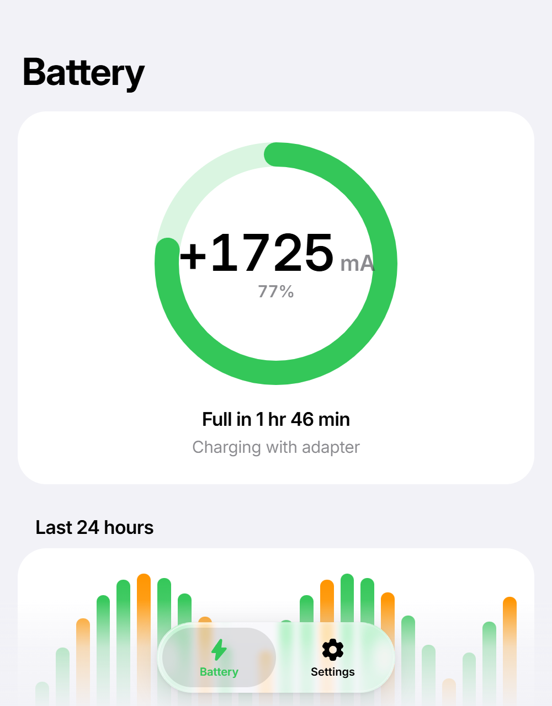
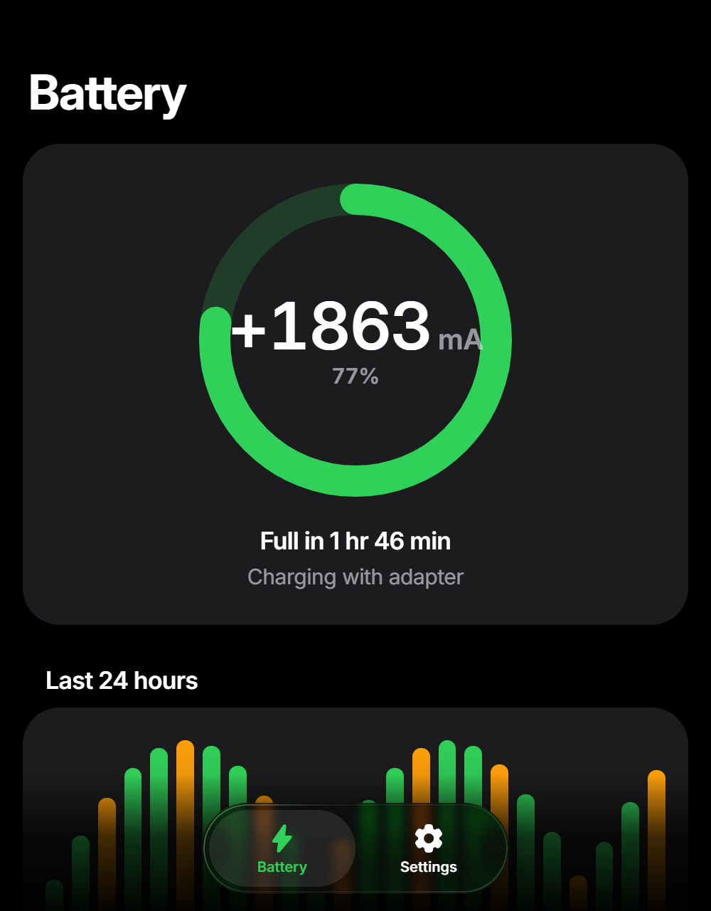

# liquid-glass-design

Claude Code için bir skill: uygulama arayüzlerini Apple'ın WWDC25'te tanıttığı **Liquid Glass** tasarım
diliyle, sanki Apple'ın kendi sistem uygulamasıymış gibi kurar. Platformdan bağımsızdır: Android
(Jetpack Compose), web (HTML/CSS, React, Vue…), Windows (WinUI 3, WPF, Electron, Tauri), Apple (SwiftUI)
ve Flutter.

*A Claude Code skill that builds app interfaces in the style of Apple's Liquid Glass (WWDC25), so they
feel like an Apple system app, on Android, web, Windows, Apple platforms and Flutter. English summary
below.*

| Açık tema | Koyu tema |
|---|---|
|  |  |

*Web şablonu Chrome'da: cam sekme çubuğu arkasındaki grafiği kenarlarında kırarak gösteriyor.*

## Kurulum

Claude Code'da, terminalde:

```bash
claude plugin marketplace add Guidin9/liquid-glass-design
claude plugin install liquid-glass-design@liquid-glass-design
```

Ya da bir oturumun içinde: `/plugin marketplace add Guidin9/liquid-glass-design`, ardından
`/plugin install liquid-glass-design@liquid-glass-design`.

Eklenti kullanmadan: `skills/liquid-glass-design` klasörünü `~/.claude/skills/` altına kopyalayın.

Güncellemek için: `claude plugin marketplace update liquid-glass-design`.

## Kullanım

Skill, arayüz isteklerinde kendiliğinden devreye girer. Örnekler:

- "Bu Android uygulamasının ayarlar ekranını Apple tarzı yap."
- "Electron ile bir not uygulaması yap, iOS gibi görünsün."
- "Web sitemin üst menüsünü Liquid Glass yap."
- "Flutter uygulamamda yüzen cam bir sekme çubuğu istiyorum."

Doğrudan çağırmak için: `/liquid-glass-design:liquid-glass-design`.

Bütün yeni uygulamalarınızda varsayılan stil olsun istiyorsanız `~/.claude/CLAUDE.md` dosyasına şunu
ekleyin: *"Arayüz tasarlarken liquid-glass-design skill'ini kullan."*

## İçerik

| Dosya | Ne işe yarar |
|---|---|
| `SKILL.md` | İş akışı, en önemli 12 kural, katman modeli, platform yönlendirmesi |
| `references/principles.md` | Apple'ın kaynaklarından derlenen kurallar ve gerekçeleri |
| `references/tokens.md` | Sistem renkleri (açık/koyu), tipografi ölçeği, köşe yarıçapları, boşluklar, cam ve hareket değerleri |
| `references/components.md` | Sekme çubuğu, büyük başlık, gruplanmış liste, anahtar, segment kontrolü, sayfa, grafik… |
| `references/review-checklist.md` | Bitirmeden önce ekran görüntüsüyle kontrol listesi |
| `references/platforms/*.md` | Android, web, Windows, Apple ve Flutter için uygulama tarifleri |
| `assets/android-compose/` | Derlenip telefonda doğrulanmış Compose şablonları (tema, sayfa, liste, cam sekme çubuğu, cam anahtar) |
| `assets/web/` | `tokens.css`, `liquid-glass.css`, `liquid-glass.js` ve tam bir `demo.html` |
| `assets/windows/` | WinUI 3 kaynak sözlüğü ve örnek sayfa |

### Platform desteği

| Platform | Cam efekti |
|---|---|
| Android 13+ (Compose) | Gerçek mercek kırılması ([backdrop](https://github.com/Kyant0/AndroidLiquidGlass) kütüphanesiyle) |
| Chromium tarayıcılar, Electron, Tauri (Windows), WebView2 | Gerçek mercek kırılması (SVG displacement) |
| Safari, Firefox | Buzlu cam yedeği (bulanıklık + parlak kenar) |
| WinUI 3 | Acrylic + parlak kenar + gölge (kırılma yok) |
| SwiftUI / UIKit | Sistemin kendi Liquid Glass'ı |
| Flutter | Impeller'da `liquid_glass_renderer`, diğerlerinde yedek |

## English

**Install:** `claude plugin marketplace add Guidin9/liquid-glass-design`, then
`claude plugin install liquid-glass-design@liquid-glass-design` (or copy `skills/liquid-glass-design`
into `~/.claude/skills/`).

**What it does:** when Claude builds or redesigns a UI, it follows Apple's Liquid Glass rules: glass only
on the floating navigation layer, opaque content, one tint, concentric continuous shapes, scroll edge
effects, large titles and inset grouped lists, iOS system colors, and the accessibility switches. It
routes to a recipe per platform and ships verified templates for Jetpack Compose and the web, plus WinUI 3
resources and SwiftUI/Flutter guidance, and finishes with a screenshot-based review checklist.

## Lisans ve atıflar

Apache-2.0 (`LICENSE`). Android cam bileşenleri, Kyant0/AndroidLiquidGlass'ın örnek uygulamasından
uyarlanmıştır (Apache-2.0). Ayrıntılar `NOTICE` dosyasında.

Bu proje Apple Inc. ile bağlantılı değildir ve Apple tarafından onaylanmamıştır. Apple'ın herkese açık
tasarım yönergelerine dayanan bir tasarım yaklaşımını anlatır. SF Pro ve SF Symbols yalnızca Apple
platformlarında kullanılabildiği için şablonlar Inter ve Material Symbols kullanır.
